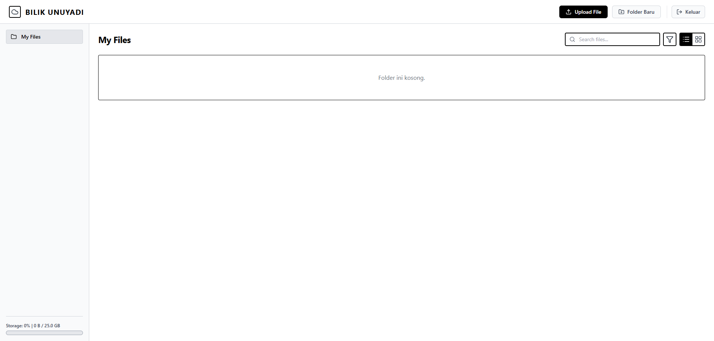
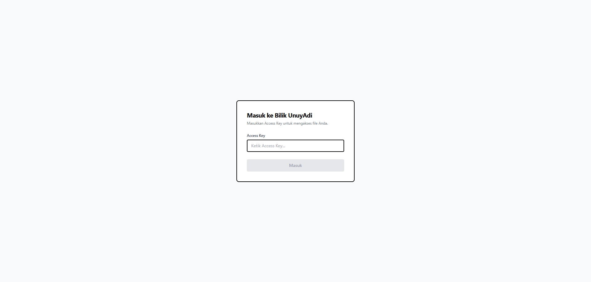
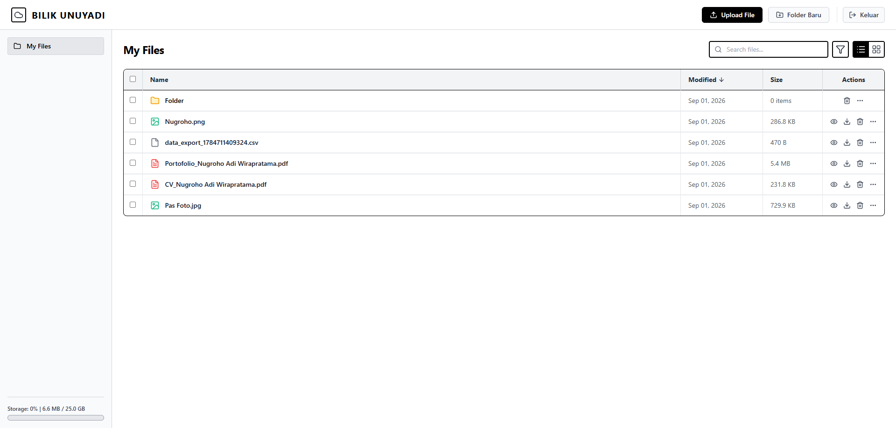
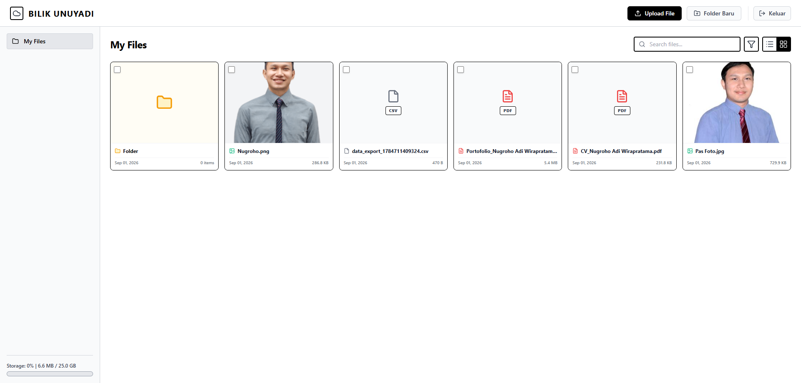
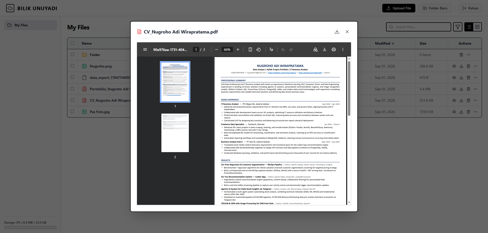
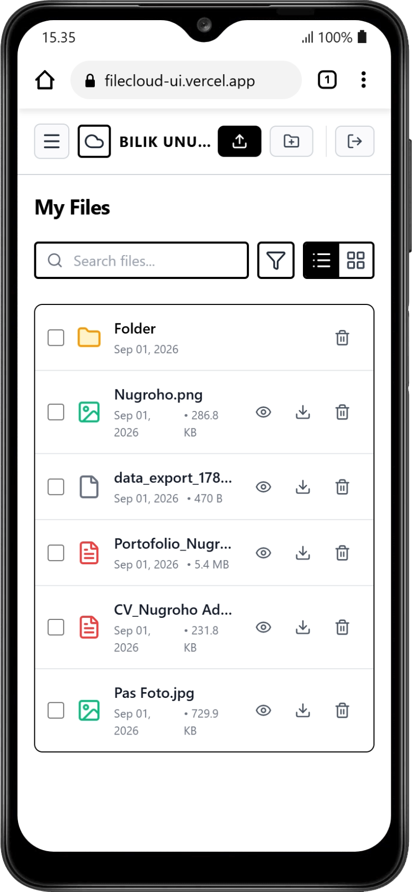
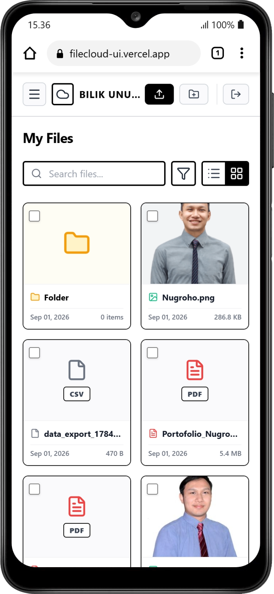

# FileCloud UI

Antarmuka web untuk manajemen file berbasis cloud pribadi yang memudahkan untuk mengunggah, mengatur, mencari, melihat pratinjau, dan mengunduh file langsung dari browser, dengan dukungan mode tampilan **List** dan **Grid**

> 🔗 Proyek ini merupakan bagian *frontend*. Untuk *backend*-nya, lihat repo [filecloud-api](https://github.com/adiwira09/filecloud-api) (FastAPI).



## ✨ Fitur

- **Autentikasi berbasis Access Key (API Key)** — login sederhana menggunakan token, lengkap dengan pembatasan percobaan gagal (rate limit 5x) dan cooldown otomatis saat terkunci.
- **Manajemen File & Folder**
  - Buat folder baru
  - Navigasi folder dengan breadcrumb
  - Hapus file/folder (single & bulk delete dengan multi-select)
- **Upload File**
  - Upload langsung untuk file berukuran kecil (< 5 MB)
  - **Chunk upload** otomatis untuk file besar (≥ 5 MB)
  - Validasi ekstensi file berbahaya (mis. `.exe`, `.php`, `.js`, `.sh`, dll) ditolak dari sisi klien
- **Pratinjau File (Preview Modal)** — mendukung pratinjau untuk gambar, PDF, teks/kode, dan tipe file lainnya
- **Pencarian File** — pencarian real-time (debounce)
- **Dua Mode Tampilan** — List View dan Grid View (dengan thumbnail untuk gambar)
- **Indikator Penyimpanan (Storage Usage)** — menampilkan kapasitas terpakai vs total kuota
- **Desain Responsif** — sidebar dengan mode hamburger menu untuk tampilan mobile

## 🛠️ Tech Stack

- [React 19](https://react.dev/)
- [Vite](https://vitejs.dev/)
- [Tailwind CSS](https://tailwindcss.com/)
- [lucide-react](https://lucide.dev/)

## 📸 Screenshot

### Halaman Login


### List View


### Grid View


### Preview File


### Tampilan Mobile (Sidebar/Hamburger Menu)
<table>
  <tr>
    <td align="center">
      
    </td>
    <td align="center">
      
    </td>
  </tr>
</table>

## 🚀 Memulai (Getting Started)

### Prasyarat

- [Node.js](https://nodejs.org/) versi 18 ke atas
- Backend [filecloud-api](https://github.com/adiwira09/filecloud-api) sudah berjalan (lokal maupun server)

### Instalasi

1. Clone repository ini

   ```bash
   git clone https://github.com/adiwira09/filecloud-ui.git
   cd filecloud-ui
   ```

2. Install dependencies

   ```bash
   npm install
   ```

3. Salin file environment contoh dan sesuaikan

   ```bash
   cp .env.example .env
   ```

   Isi variabel berikut sesuai alamat backend Anda:

   ```env
   VITE_API_BASE_URL=http://localhost:8000
   ```

4. Jalankan mode development

   ```bash
   npm run dev
   ```

5. Buka `http://localhost:5173` di browser, lalu masukkan **Access Key** yang telah dikonfigurasi di backend untuk masuk

### Build untuk Produksi

```bash
npm run build
npm run preview
```

## 📁 Struktur Proyek

```
src/
├── assets/                 # Gambar & aset statis
├── components/
│   ├── file-explorer/      # Komponen tampilan List & Grid file
│   ├── layout/              # Header & Sidebar
│   ├── modals/              # Modal Upload, New Folder, Preview
│   ├── AuthScreen.jsx        # Halaman login (Access Key)
│   └── GridImageThumbnail.jsx
├── utils/
│   └── constants.js         # Konfigurasi API base URL & ekstensi file yang dilarang
├── App.jsx                  # Komponen utama aplikasi
└── main.jsx                 # Entry point
```

## 🔒 Autentikasi

Aplikasi ini menggunakan header `X-API-Key` untuk setiap request ke backend. Access Key dimasukkan sekali melalui halaman login dan disimpan di `localStorage` browser

## 🤝 Kontribusi

Kontribusi, laporan bug, dan saran fitur sangat terbuka. Silakan buat *issue* atau *pull request* di repository ini

